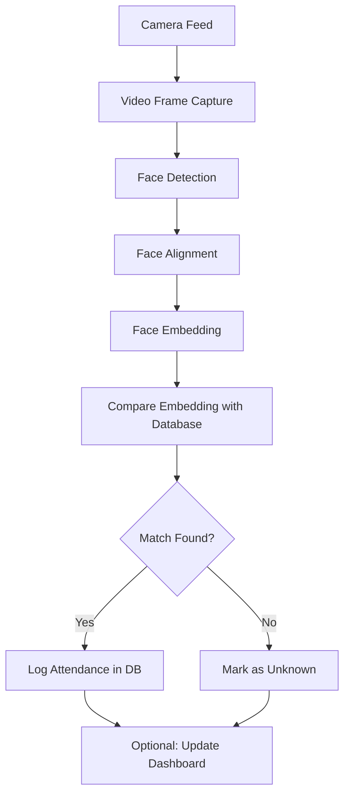

# 📄 Real-Time Face Recognition-based Attendance System  

## 📋 Project Overview  
This system automates attendance recording by recognizing individuals in real time using face recognition.  
It replaces manual and contact-based systems (cards, fingerprints) with a contactless, AI-powered solution.  

---  

## 🎯 Goals
✅ Contactless and hygienic attendance marking  
✅ Real-time recognition with high accuracy  
✅ Logging attendance into a database  
✅ Optional dashboard for admins to monitor & generate reports  

---  

## 🔷 Key Features
- Real-time video feed processing
- Face detection, alignment & recognition
- Attendance logging with timestamps
- Database of enrolled users
- Prevents duplicate entries within a session
- (Optional) Web dashboard for reports

---  

## 🧱 Architecture

```
                +----------------------+
                |      Camera (IP/USB)|
                +----------------------+
                          |
                          v
                +----------------------+
                |   Video Capture (CV)|
                +----------------------+
                          |
                          v
                +----------------------+
                |   Face Detection     |
                | (RetinaFace/MTCNN)  |
                +----------------------+
                          |
                          v
                +----------------------+
                | Face Alignment &     |
                | Embedding Extraction |
                |   (ArcFace)          |
                +----------------------+
                          |
                          v
                +----------------------+
                | Compare with DB      |
                | (Cosine Similarity)  |
                +----------------------+
                          |
               +-------------------------------+
               | Attendance Logging (DB/CSV)  |
               +-------------------------------+
                          |
                          v
          +--------------------------------------------+
          | Optional: Web Dashboard / Reports         |
          +--------------------------------------------+
```

---  

## 🔷 Components

### 🎥 Camera
- USB webcam or CCTV/IP camera  
- Provides continuous video stream  

### 🧠 Face Detection
- Detects face(s) in each frame
- Options: MTCNN, RetinaFace, YOLOv8-face  

### 🎨 Face Alignment
- Aligns the detected face to a canonical position  

### 🔷 Embedding Model
- Converts face to a unique embedding vector
- Recommended: ArcFace from InsightFace  

### 📋 Database
- Stores:
  - User profiles (name, id, embedding, image path)
  - Attendance logs (user id, name, date, time)

### 📊 Dashboard (Optional)
- View present/absent employees
- Export reports
- Built using Flask/Django + Bootstrap/React  

---  

## 📄 Data Flow Diagram



---  

## 📝 Database Design

### 📂 Tables

#### Table: `users`
| Field       | Type        |
|-------------|-------------|
| id          | INT (PK)   |
| name        | TEXT       |
| embedding   | ARRAY / BLOB |
| image_path  | TEXT       |

#### Table: `attendance`
| Field         | Type      |
|---------------|-----------|
| id            | INT (PK) |
| user_id       | INT (FK) |
| timestamp     | DATETIME |
| camera_id     | TEXT     |

---  

## 🔷 Tech Stack

| Layer | Technology |
|-------|------------|
| Video Capture | OpenCV |
| Face Detection | RetinaFace / MTCNN |
| Embedding | ArcFace (InsightFace) |
| Backend | Python |
| Database | SQLite / MySQL |
| Dashboard | Flask / Django + Bootstrap/React |

---  

## 🚀 Workflow Example
1️⃣ User stands in front of camera  
2️⃣ Camera sends frame → system detects & aligns face  
3️⃣ Embedding is generated & matched with known database  
4️⃣ If match found → mark attendance  
5️⃣ Attendance record saved in DB  
6️⃣ (Optional) Dashboard updated in real time  

---  

## ⚡ Challenges & Mitigation

| Challenge | Mitigation |
|-----------|------------|
| Lighting & pose variations | Use robust detectors & embeddings |
| Spoofing with photos | Add liveness detection |
| Privacy concerns | Local storage & GDPR compliance |
| Scale (many users) | Use FAISS for fast search |

---  

## 🌟 Optional Extensions
- Multi-camera support
- Notifications on late/absent users
- Cloud synchronization & backup
- Edge deployment (Raspberry Pi / Jetson Nano)

---  

## 📦 Suggested Directory Structure
```
face_attendance/
├── app.py                  # main backend
├── enroll.py               # script to enroll users
├── recognize.py            # real-time recognition loop
├── database/
│   └── attendance.db
├── templates/
│   └── dashboard.html
├── static/
│   └── css/
├── requirements.txt
├── README.md
```


---  


| Task           | Library Function   | Model Used                          |
| -------------- | ------------------ | ----------------------------------- |
| Face Detection | `face_locations()` | HOG (default) or CNN                |
| Embedding      | `face_encodings()` | ResNet (dlib, outputs 128-d vector) |


File Name	Purpose
embedding_module.py	A pure function that takes a single image/tensor and returns a face embedding vector. This is the "core logic" of how to generate embeddings.
embedder.py	A wrapper or utility script that loads an image, detects the face, calls embedding_module.py to get embeddings, and saves or returns them.

🧠 Think of it like this:
embedding_module.py = Brain (it knows how to generate face embeddings)

embedder.py = Worker (it uses the brain to embed multiple faces or process input files)


✅ What You're Using
Purpose	Your Choice / Module Used
Face Detection	MTCNN from facenet_pytorch (detect_faces.py)
Face Embedding	Likely InceptionResnetV1 or similar from facenet_pytorch (embedding_module.py)
Face Matching	Cosine similarity (via utils/similarity.py)
Storage	Supabase image upload and embedding storage (supabase_utils)
Drawing on frame	Custom utility (draw_box in utils/image_utils.py)


## 📚 References
- [InsightFace](https://github.com/deepinsight/insightface)  
- [OpenCV](https://opencv.org/)  
- [MTCNN](https://github.com/ipazc/mtcnn)  
- [ArcFace Paper](https://arxiv.org/abs/1801.07698)  

---  

## ✨ Contribution & License
Feel free to fork, modify and contribute to this project!  
MIT License / Open to suggestions.
